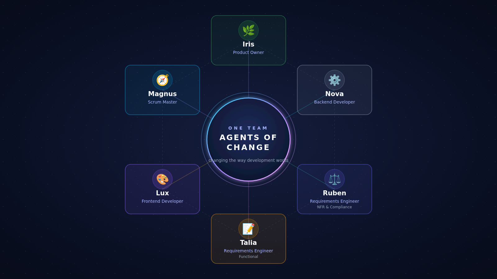

# Agents of Change

> **Expert engineers and autonomous AI agents, shipping software as one team.**

We're changing the way development works: pairing human judgment with AI acceleration to make delivery faster, clearer, and more thoughtful.

## How we work

- **Human-led direction** — people set the intent, priorities, and quality bar.
- **AI-augmented delivery** — agents help turn ideas into code, tests, documentation, and decisions.
- **One continuous loop** — plan → build → verify → learn, with feedback travelling both ways.

No hand-offs for the sake of hierarchy. No black-box automation for its own sake. Just a collaborative engineering system designed to help good teams do their best work.

## The core team

Six complementary roles make the system work: product ownership, delivery leadership, backend engineering, frontend engineering, functional requirements, and NFR & compliance. The constellation below shows the people and perspectives behind the work.

## Start here

- [TinyURL](https://github.com/theagentsofchange/TinyURL) — our internal URL-shortener project and delivery showcase.
- Browse the repositories for the experiments, tools, and practices we use to explore the future of software development.

*Build differently. Learn continuously. Change what software delivery can be.*
